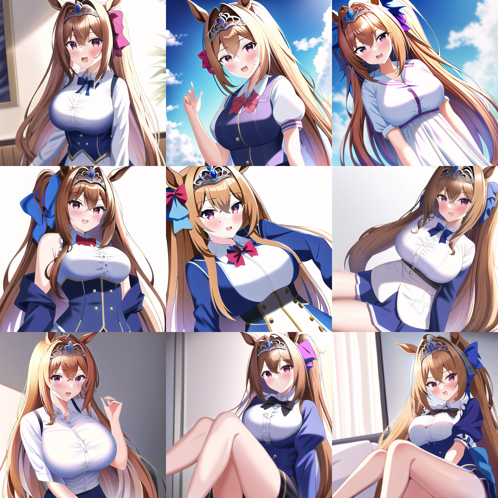
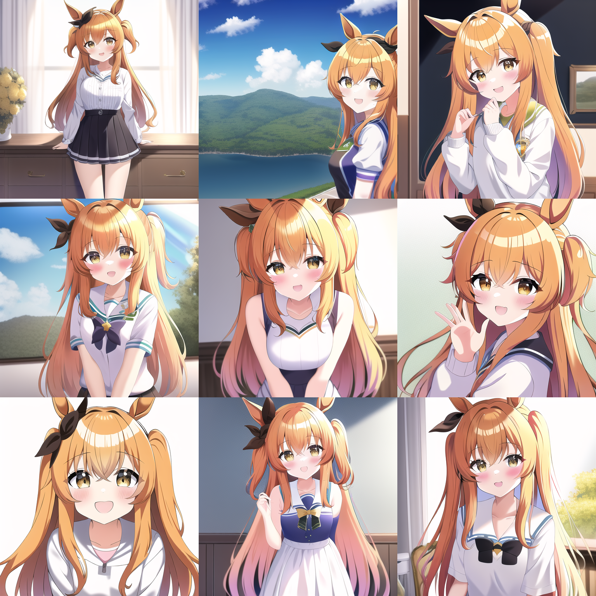

<!-- @import "[TOC]" {cmd="toc" depthFrom=1 depthTo=6 orderedList=false} -->

<!-- code_chunk_output -->

- [**WARNING**](#warning)
  - [agm](#agm)
  - [blue_archive](#blue_archive)
  - [curren_chan](#curren_chan)
  - [daiwa_scarlet](#daiwa_scarlet)
  - [danimaru](#danimaru)
  - [gaou](#gaou)
  - [happoubi_jin](#happoubi_jin)
  - [hina_blue_archive](#hina_blue_archive)
  - [Hxxg](#hxxg)
  - [mayano_topgun](#mayano_topgun)
  - [MdaStarou](#mdastarou)
  - [mignon](#mignon)
  - [mutsuki_blue_archive](#mutsuki_blue_archive)
  - [puuzaki_puuna](#puuzaki_puuna)
  - [rice_shower](#rice_shower)
  - [satono_diamond](#satono_diamond)
  - [shiroko](#shiroko)
  - [tamanokedama](#tamanokedama)
  - [tomose_shunsaku](#tomose_shunsaku)
  - [Shiina](#shiina)
  - [liaoLumine](#liaolumine)
  - [nahida](#nahida)
  - [lihuazou_final](#lihuazou_final)
  - [hiten_1](#hiten_1)
  - [atri1](#atri1)

<!-- /code_chunk_output -->
# **WARNING**
本文档不适宜在工作环境浏览，虽然作者已经尽量在np里加nsfw了(

## agm
八重神子(原神)

## blue_archive
碧蓝档案

## curren_chan
真机伶(马娘)

## daiwa_scarlet
大和赤骥(马娘)

## danimaru
画师

## gaou
画师

## happoubi_jin
八宝备仁(画师)

## hina_blue_archive
日奈(碧蓝档案)

## Hxxg
画师

## mayano_topgun
重炮(马娘)

## MdaStarou

## mignon
画师

## mutsuki_blue_archive
睦月(碧蓝档案)

## puuzaki_puuna
画师

## rice_shower
米浴(马娘)

## satono_diamond
里见光钻(马娘)

## shiroko
白子(碧蓝档案)

## tamanokedama
毛玉(画师)

## tomose_shunsaku
画师

## Shiina
图源群友

## liaoLumine
荧(原神)

## nahida
纳西妲(原神)

## lihuazou_final
立华奏

## hiten_1
画师

## atri1
atri
